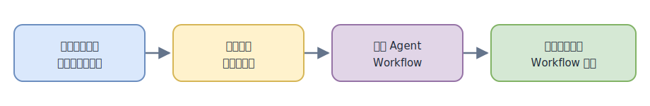
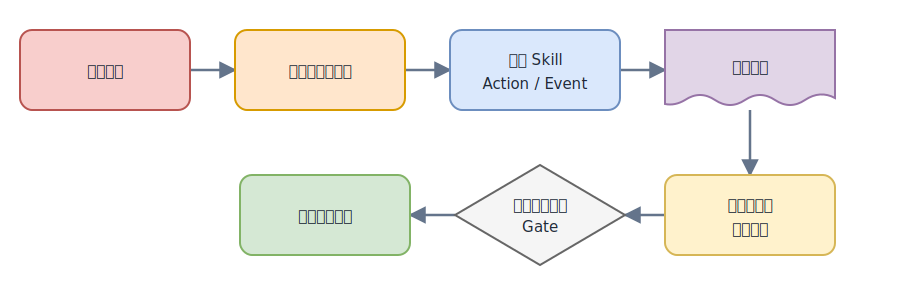
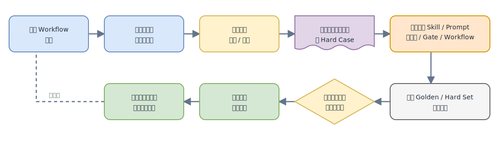
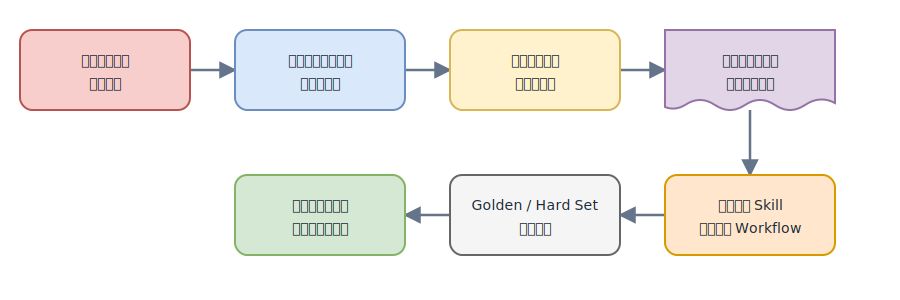

# Agent 工作流离线评测与错误归因方案对比

## 1. 现有文档在讲什么

《AI 开发流程产出物评测集与指标体系完整方案》设计的是一套**阶段级离线评测体系**。

它把 Agent 开发流程拆成 N1、N2、N3、N4、N6、N7 等阶段，为每个阶段分别定义：

- 测试 Case 和输入材料
- 预期行为、Golden 和 Oracle
- Rule、Evidence、Traceability、LLM Judge 等 Grader
- 阶段指标、评分公式和 block/warn 门槛

主要使用方式是：修改模型、Prompt、Skill、知识库或 Workflow 后，重新运行 Golden Set 和 Hard Set，比较任务覆盖率、事实准确率、证据回链率等指标是上升还是下降。

它可以定位到“哪个阶段、哪个产物、哪个指标不合格”，但没有设计真实 Session 的持续记录、具体执行步骤定位和反向根因归因。

## 2. 我们方案的设计意图

我们的设计意图，是把现有 Agent 流程的离线质量评测向真实开发现场延伸：不仅在改版后判断分数上涨还是下降，还能在真实流程运行时看见阶段状态，在问题出现后快速复盘，并把业务专家的确认沉淀为可复用数据。

当一条真实流程执行结束后仍出现问题，希望系统辅助回答：

- 问题最早出现在哪个阶段、哪个 Skill？
- 哪个具体 Action/Event 与问题相关？
- 使用了哪个版本的状态或产物？
- 错误如何影响后续阶段？
- 为什么 Review、测试或 Gate 没有及时拦住？

目标不是再做一套独立评分体系，而是连接三个当前分散的环节：

```text
真实流程中的问题发现和复盘
→ 领域专家低成本确认
→ 修改 Agent Workflow
→ 离线评测验证 Workflow 改动
```



[可编辑 draw.io 源文件](./assets/agent-eval-attribution/design-intent-flow.drawio)

这样既能帮助人更快定位和修改 Skill、知识库、Gate 或 Workflow，也能把真实运行中的高价值业务判断沉淀为后续评测和优化所需的数据基础。

详细设计将在配套的《真实流程错误诊断与反向归因实现方案》中展开。

## 3. 二者的核心差异

| 维度 | 现有离线评测 | 我们的错误归因 |
|---|---|---|
| 核心问题 | 产物质量好不好，版本是否退化 | 真实问题在哪一步产生，为什么没被拦住 |
| 分析单位 | 阶段 Case、产物、指标 | Session、Skill Action、Event、证据 |
| 主要输入 | 预设 Case、Expected、Golden、Oracle | 实际 Session、workflow manifest、work_status、真实产物、用户反馈 |
| 主要输出 | 分数、block/warn、失败指标 | 可疑阶段/Skill/Event、候选根因、证据引用 |
| 上下游关系 | 静态检查产物覆盖和一致性 | 根据真实执行顺序分析问题传播路径 |
| 典型用途 | Skill/Prompt/知识库/流程改版回归 | 真实事故复盘和单次 Session 定位 |

现有评测属于“质量检测和一级定位”；我们的方案是在此基础上继续完成“执行步骤定位和候选根因分析”。

## 4. 可以参考和复用的内容

现有方案中以下内容可以直接成为归因系统的输入：

- 各阶段的产物契约和关键指标
- Rule、Traceability、Evidence Grader
- `failure_modes` 失败模式分类
- requirement → design → task 的覆盖关系
- Golden Set、Hard Set 和真实失败样本
- block/warn 规则和人工校准机制

每个 Grader 不应只输出分数，还应输出统一的违规记录：

```text
finding_id
constraint_id
stage/action_id
type
target
expected
observed
evidence_refs
severity
```

这些 Finding 可以作为归因分析的已知症状和确定性证据。

## 7. 实时诊断、人机标注与自进化飞轮

这套系统的价值不只是在事后给出诊断报告，还可以提供更实时的过程查看和可回放的事后复盘：

- 流程运行中准实时展示阶段、Skill、产物、验证和 Gate 状态。
- 出现异常时自动收敛到可疑 Action/Event，并展示证据。
- 流程结束后按时间线回放问题产生和向后传播的过程。
- 领域专家只需确认、纠正或标记“证据不足”，不必从头阅读完整 Session。

人工确认后的结果可以沉淀为结构化真实样本：

```text
业务症状
→ 违规阶段和约束
→ 关键 Skill/Action/Event
→ 证据引用
→ 人工确认的候选根因
→ 应当拦截问题的 Gate
→ 最终处理结果
```



[可编辑 draw.io 源文件](./assets/agent-eval-attribution/human-label-flow.drawio)

这相当于把高成本的业务数据标注嵌入真实 Agent 开发过程。业务专家在上下文仍然清晰时顺手确认系统诊断，比事后重新组织专家阅读日志、理解业务并单独标注更准确、成本更低。

确认数据可以进一步驱动流程优化：

```text
真实 Workflow 运行
→ 自动诊断和可视化复盘
→ 领域专家确认/纠正
→ 生成真实标注数据和 Hard Case
→ 定向修改 Skill、Prompt、知识库、Gate 或 Workflow
→ 运行 Golden/Hard Set 离线评测
→ 关键指标通过且没有回归
→ 人工接受本次流程变更
→ 新版本继续产生真实运行数据
```



[可编辑 draw.io 源文件](./assets/agent-eval-attribution/workflow-optimization-flywheel.drawio)

后续可以提供脚手架，统一完成 Session 接入、规则注册、诊断展示、人工确认、Case 生成和评测触发；再与 Skill Opt 等优化机制结合，根据真实失败样本生成候选改动，但必须经过离线评测和人工审批后才能进入正式 Workflow。

需要保留以下边界：

- 人工确认样本先进入 Candidate/Verified Set，不自动成为 Golden。
- 提供“确认、纠正、证据不足”三种轻量操作，不能逼迫专家选择一个伪根因。
- 训练集、优化集和最终回归集必须隔离，避免同一案例既用于优化又用于验收。
- Workflow 变更不能只看总分，还必须满足关键 block 指标且不能引入历史回归。
- 业务数据需要权限控制、脱敏、版本记录和可追溯审计。
- 自动优化只负责提出候选修改，不能绕过人工审批直接发布。

## 8. 总结

现有方案负责回答“哪里不合格、改版后质量是否提高”；我们的方案负责回答“这次问题具体在哪一步产生、为什么没有被拦住”。

两者应当串联，而不是互相替代：

```text
离线评测规则发现问题
→ 归因系统定位执行步骤和候选根因
→ 领域专家在真实开发现场确认或纠正
→ 真实案例沉淀为可复用数据集
→ 定向优化 Skill、知识库和 Workflow
→ Golden/Hard Set 验证变更
→ 人工接受后进入下一轮真实运行
```



[可编辑 draw.io 源文件](./assets/agent-eval-attribution/closed-loop-summary-flow.drawio)
