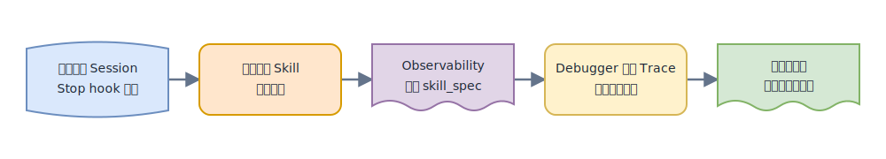
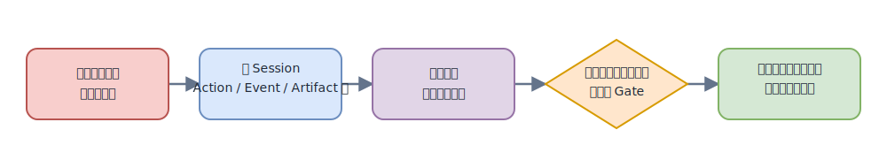
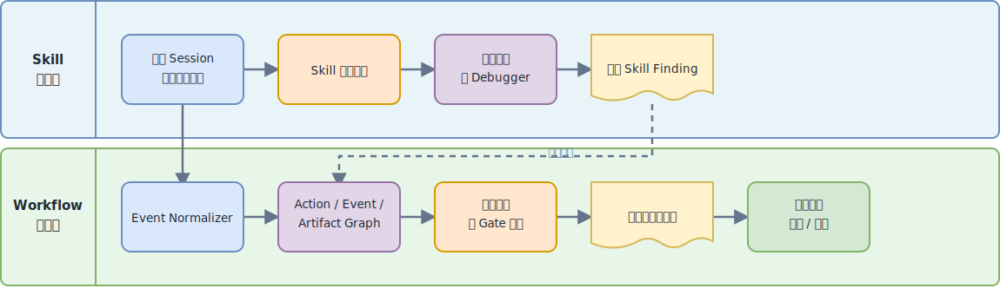
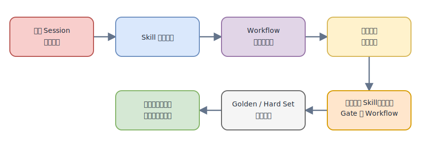

# Skill 真实 Trace 评测与错误归因方案对比

## 1. 现有文档在讲什么

《Skill 评测体系——选型综述与方法设计》设计的是一套**基于真实 Session Trace 的 Skill 执行评测体系**。

它先把 Skill 分成能力提升型和偏好编码型。该体系中的多数 Skill 属于偏好编码型，因此评测重点不是有无 Skill 的成功率差异，而是 Skill 是否忠实执行了团队定义的流程。

其核心做法是：用户运行结束后，由 Stop hook 上传完整 CC Session JSONL；离线管道提取目标 Skill 的执行窗口和运行时实际加载的 `SKILL.md`；Observability Agent 把自然语言规则整理成 `skill_spec.md`；Debugger Agent 再对照真实 Trace，检查任务结果、步骤、产物、工具、效率和容错，输出评分、Finding 和修改建议。

```text
完整真实 Session 上报
→ 提取目标 Skill 执行窗口
→ Observability 生成 Skill 规格
→ Debugger 对照 Trace 查找偏离
→ 输出评分、证据、候选根因和修改建议
```



[可编辑 draw.io 源文件](./assets/skill-trace-eval-vs-attribution/skill-trace-eval-flow.drawio)

这里需要区分：**采集的是完整 Session，但一次评测的责任范围主要是某个 Skill 的执行窗口**。helper Skill 可以保留在窗口内；接管流程的 handoff Skill 和后续平级 Skill 用来关闭窗口，避免把下游行为错误归到当前 Skill。

文中的 Observability Agent 也不是实时监控器，更接近“Skill 规格提取器”：它读取运行时 `SKILL.md`，提炼 Phase、可观测动作、工具、顺序、产物和约束，供 Debugger 复用。

## 2. 我们方案的设计意图

我们的方案不是替代 Skill Trace 评测，而是在其上增加**问题驱动的全流程反向归因层**。

当真实流程最终出现业务问题时，分析起点不是“这个 Skill 有没有遵循规则”，而是已经确认的症状或用户反馈；分析范围也不止一个 Skill 窗口，而是整个 Session 中跨阶段、跨 Skill、跨 Action、跨产物和 Gate 的关系。

```text
最终业务问题或用户反馈
→ 构建全 Session Action/Event/Artifact 图
→ 从症状反向追踪跨阶段传播链
→ 定位首次异常、候选根因和漏检 Gate
→ 领域专家确认、纠正或标记证据不足
```



[可编辑 draw.io 源文件](./assets/skill-trace-eval-vs-attribution/scope-extension-flow.drawio)

它重点回答：问题最早在哪里产生、使用了哪个版本的输入或产物、怎样影响下游、为什么 Review/测试/Gate 没有拦住，以及哪些证据真正支持这个判断。

详细设计将在配套的《真实流程错误诊断与反向归因实现方案》中展开。

## 3. 二者的核心差异

| 维度 | Skill 真实 Trace 评测 | 全流程错误归因 |
|---|---|---|
| 核心问题 | 某个 Skill 是否按运行时规则正确执行 | 最终问题在哪一步产生、如何传播、为何未被拦截 |
| 分析起点 | 目标 Skill 和运行时 `SKILL.md` | 业务症状、用户反馈或确定性 Finding |
| 数据范围 | 完整 Session 被采集，评分主要限制在 Skill 窗口 | 整个 Session 及关联阶段、Skill、Action、Event、Artifact、Gate |
| 判断基准 | `skill_spec.md` 中提炼的步骤和约束 | Workflow manifest、状态、事件图、产物血缘、规则 Finding 和业务反馈 |
| 定位方式 | 对照规则查遗漏、偏离、工具错误和未恢复故障 | 从症状反向搜索首次异常、传播路径和漏检责任 |
| 因果能力 | 输出 `skill_defect` 等候选类别和针对性修改 | 输出带证据的候选根因、上下游因果链和应拦截 Gate |
| 时效性 | Session 结束后离线回放 | 离线复盘为基础，可进一步接准实时 Hook |
| 主要修改对象 | SKILL.md 及其执行规则 | Skill、Prompt、知识库、数据、Gate 或整个 Workflow |

现有方案已经具有错误诊断能力，但本质上仍是**规则驱动的 Skill 执行审计**；我们的方案要进一步完成**业务问题驱动的跨窗口因果归因**。

## 4. 可以参考和复用的内容

现有方案中以下能力可以直接作为全流程归因系统的基础设施：

- Stop hook、S3 Session 上报和按时间窗拉取机制。
- `overview.md`、`messages.jsonl`、`skill_invocations.json`、`subagents/` 的 Trace 分层结构。
- 运行时实际加载的 `skill_{name}.md` 快照，避免用当前版本误判历史 Session。
- helper/handoff Skill 的窗口切分规则。
- `executed`、`skipped`、`unanchorable` 三态 Phase 模型。
- 用户纠偏消息、工具错误、产物缺失等强证据扫描。
- Finding 中的证据、候选根因、修改建议和预期影响字段。

归因层需要在 Skill Finding 上补充跨流程字段：

```text
session_id
stage_id / skill_id / action_id / event_id
artifact_id / artifact_version
symptom_id
upstream_causes
downstream_impacts
expected_gate
evidence_refs
human_verdict
```

这样 Skill Debugger 输出可以成为归因系统的局部证据，而不是被另起一套逻辑重复实现。

## 7. 推荐的衔接方式与数据闭环

推荐保留两个层次：Skill 评测层负责把每个窗口内的确定性偏离和证据找出来；Workflow 归因层负责结合完整 Session、产物血缘和 Gate 状态，把局部 Finding 连接成跨阶段因果链。

```text
完整 Session 与运行时规则
→ Skill 评测层：窗口切分、规格提取、局部 Finding
→ Workflow 归因层：事件图、传播分析、Gate 责任
→ 归因报告与时间线
→ 领域专家确认或纠正
```



[可编辑 draw.io 源文件](./assets/skill-trace-eval-vs-attribution/two-layer-diagnosis-architecture.drawio)

专家确认后的结果继续进入优化与验收闭环：

```text
真实 Session 产生问题
→ Skill 局部诊断
→ Workflow 跨阶段归因
→ 专家确认真实根因
→ 定向修改 Skill、知识库、Gate 或 Workflow
→ Golden/Hard Set 离线评测
→ 人工接受后进入下一轮真实运行
```



[可编辑 draw.io 源文件](./assets/skill-trace-eval-vs-attribution/integration-closed-loop.drawio)

需要保留以下边界：

- Skill Debugger 的候选根因不能直接当作全流程真实根因。
- 完整 Session 被采集不等于已经完成全流程归因，必须显式建立跨窗口关系。
- LLM Finding 必须引用 Trace 或产物证据，并允许人工选择“证据不足”。
- 人工确认样本先进入 Candidate/Verified Set，不能自动进入 Golden。
- 自动提出的修改必须经过 Golden/Hard Set 回归和人工审批。

## 8. 总结

Skill 真实 Trace 评测负责回答“这个 Skill 在它负责的窗口里有没有按规则执行”；全流程错误归因负责回答“最终问题从哪里产生、如何跨阶段传播、为什么没有被 Gate 拦住”。

两者最合理的关系是：

```text
Skill 评测提供局部证据
→ Workflow 归因连接跨阶段因果关系
→ 专家确认形成真实标注
→ 定向修改后由离线评测负责验收
```
